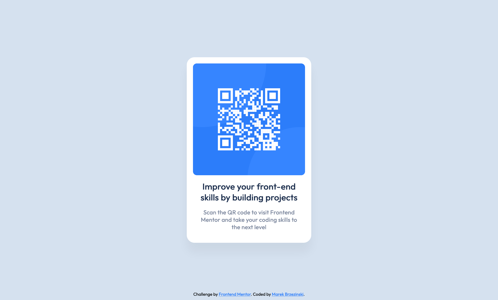

# Frontend Mentor - QR code component solution

This is a solution to the [QR code component challenge on Frontend Mentor](https://www.frontendmentor.io/challenges/qr-code-component-iux_sIO_H). Frontend Mentor challenges help you improve your coding skills by building realistic projects.

## Table of contents

- [Overview](#overview)
  - [Screenshot](#screenshot)
  - [Links](#links)
- [My process](#my-process)
  - [Built with](#built-with)
  - [What I learned](#what-i-learned)
- [Author](#author)

## Overview

### Screenshot

### Links

- [Link to the Git repository](https://github.com/marekbrze/Frontend-Mentor-QR-Code-Challenge)
- [Live Demo](https://marekbrze.github.io/Frontend-Mentor-QR-Code-Challenge/)

## My process

### Built with

- Plain HTML5
- Used CSS Variables and Flexbox

### What I learned

The main challenge in this project was to create and position two circles in the qr code background.

## Author

- Linkedin - [Marek Brzeziński](https://www.linkedin.com/in/marekbrzezinski/)
- Frontend Mentor - [@marekbrze](https://www.frontendmentor.io/profile/yourusername)
- Twitter - [@marekbrze](https://www.twitter.com/marekbrze)
